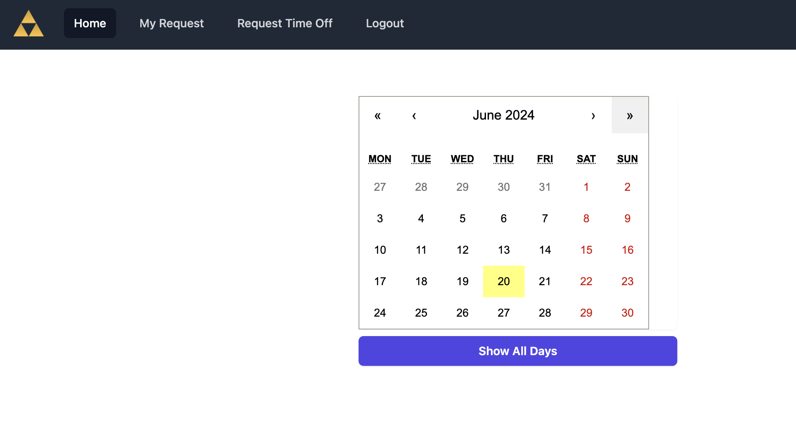

# PTO Management System

## Description

This application can be used by an employer to manage the time off request from their employees.  The application allows any user to see employees who are scheduled to be off without logging in.  Requesting time off does require a user to authentication with an email and password.

This is a MERN stack application.  The data for employees and requested days off is stored in MongoDB.  Node.js and Express is used for the backend.  The front-end uses React for end users to interact with and connect to the backend.

A deployed version of this application can be found at https://pto-management-system.onrender.com

To test the site, the following credentials can be used  
email: trinidad@test.com  
password: password  

## Installation

1.  Before installation, verify that the following is installed
     MongoDB version 6.0.10
     Node.js version 21.3.0
2.  Download the files from the repository to a local machine.  The location where the files are placed will be the root location of the application
3.  From the root of the application, run the following command to install the required packages
     npm run install
4.  To connect this application to the MongoDB application that it will use, update the .env.example files with the MongoDB URI.  There is a .env.example file in the root directory and in the server directory
5.  Rename the .env.example files to .env
6.  Update the server/config/seeds.js file with the employee information.  Locate the string "await Employee.create" in the seeds.js file and update the object with the information of the employees.  For multiple employees, copy this section and paste it multiple times for each employee.  Currently the seeds.js file has examples for two employees.
7.  The seeds.js file currently has configuration to input data for days off.  To prevent this data from being put in the database, comment out the following section (this section appears twice in the seeds.js file)
     const employee = await Employee.findOne({ email: 'trinidad@test.com' })
     await DaysOff.create({
        employeeId: employee._id,
        dayOff: '10-11-2024',
        hours: 8
    })
8.  From the root of the application, run the following command to insert the employee data
     npm run seed
9.  To start the application, run the following command from the root of the application
     npm run dev

## Usage

After launching the application, open a browser and navigate to http://localhost:3000 to access the application.  The following screenshot shows how the page looks on first load when a user is not logged in.

Select the Login tab and then provide credentials to login to the application.  The following screenshot shows how the page looks once a user has logged in.

Once a user is logged in, request for days off can be made in the "Request Time Off" tab.  Once on this page, the user can select a day in the calendar and after selecting, it will list the users who are scheduled off for the day.  The application allows for a maximum of 5 users to be out on a single day.  After selecting a day, a "Request Day Off" button appears if there are spots available.  The following screenshot shows this

## License

This application is [MIT licensed](./LICENSE).
